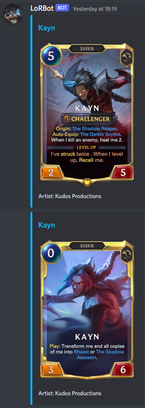
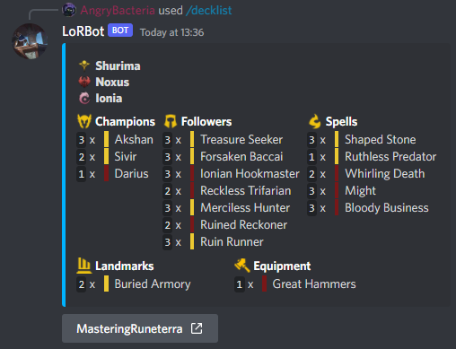
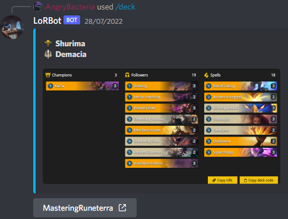

**Update June 2023**
Sadly there is just no time for me to keep this project updated. It still works if you copy the source code and run it yourself, but the newest additions to the game are not in the bot anymore. Maybe in the future I can start working on it again, but for now this project is on hold :(

**This is a companion bot for the Online-Cardgame Legends of Runeterra**

It can display cards and decks as images or messages
It can also display Meta-deck information (is currently not automatically updated) and Player information

This bot uses the JDA library to communicate with discord. Information about cards originate from the official LoR Data 
Dragon. To use it just edit the config.properties file to your liking. 

[Use this link if you want the bot on your Server. Hosted by me](https://discord.com/api/oauth2/authorize?client_id=959146664160018482&permissions=414464658496&scope=bot%20applications.commands)

**Display Cards**

**Display Decks as a message in List format**

**Display a Deck with a picture**

